# Threat Intelligence Feed Aggregator

[](https://www.python.org/downloads/)
[](https://huggingface.co/spaces/Dheepak27/SocieteGeneral)
[](https://huggingface.co/spaces/Dheepak27/SocieteGeneral)

An **AI-powered cybersecurity dashboard** that aggregates, analyzes, and visualizes real-time threat intelligence from multiple sources. This platform helps cybersecurity professionals efficiently process large volumes of threat data by providing automated analysis, IOC extraction, and interactive visualizations.

## 🔍 Overview

The Threat Intelligence Feed Aggregator is designed to solve the critical challenge of information overload in cybersecurity. With hundreds of threat intelligence articles published daily across various sources, security analysts need an efficient way to:

- **Aggregate** threat intelligence from multiple RSS feeds
- **Extract** actionable Indicators of Compromise (IOCs)
- **Summarize** complex articles using AI
- **Visualize** threat patterns and trends
- **Export** data for further analysis

## 🏗️ Architecture


### System Components

| Component | File | Description |
|-----------|------|-------------|
| **Threat Intelligence Aggregator** | `app.py` | Central orchestrator that manages data flow, RSS feed collection, and component coordination |
| **IOC Extractor** | `ioc_extractor.py` | Advanced pattern matching engine for extracting Indicators of Compromise |
| **AI Summarizer** | `ai_summarizer.py` | AI-powered content analysis using Ollama LLM with intelligent fallback |
| **Visualizer** | `visualization_utils.py` | Interactive chart and graph generator using Plotly |
| **Data Structure** | `ioc_extractor.py` | Standardized IOCResult dataclass for consistent data handling |

## 🚀 Quick Start

### Prerequisites

- Python 3.8 or higher
- [Ollama](https://ollama.ai/) (optional, for AI summarization)
- Internet connection for RSS feed access

### Installation

1. **Clone the repository:**
```bash
git clone https://github.com/Dheepak27/Threat-Intelligence-Feed-Aggregator.git
cd Threat-Intelligence-Feed-Aggregator
```

2. **Install dependencies:**
```bash
pip install -r requirements.txt
```

3. **Install Ollama (Optional but recommended):**
```bash
# For macOS/Linux
curl -fsSL https://ollama.ai/install.sh | sh

# Start Ollama service
ollama serve

# Pull a model (e.g., llama2)
ollama pull llama2
```

4. **Run the application:**
```bash
python app.py
```

5. **Access the dashboard:**
Open your browser and navigate to the URL displayed in the terminal (typically `http://127.0.0.1:7860`)

## 📊 Features

### Core Capabilities

- **Multi-Source Aggregation**: Collects threat intelligence from 15+ RSS feeds
- **AI-Powered Analysis**: Leverages local LLMs for intelligent content summarization
- **IOC Extraction**: Identifies 18+ types of indicators including IPs, domains, hashes, CVEs
- **Interactive Visualizations**: Dynamic charts showing threat trends and patterns
- **Real-time Processing**: Live data refresh with progress tracking
- **Export Functionality**: CSV export for further analysis

### Supported IOC Types

| Category | Types | Examples |
|----------|--------|----------|
| **Network** | IP Addresses, Domains, URLs | `192.0.2.1`, `evil.com`, `http://malicious.site` |
| **Cryptographic** | MD5, SHA1, SHA256 Hashes | `d41d8cd98f00b204e9800998ecf8427e` |
| **Vulnerabilities** | CVE IDs | `CVE-2023-12345` |
| **Communications** | Email Addresses | `attacker@malicious.com` |
| **System** | File Paths, Registry Keys, Mutex Names | `/tmp/malware`, `HKEY_LOCAL_MACHINE\...` |
| **Cryptocurrency** | Bitcoin Addresses | `1A1zP1eP5QGefi2DMPTfTL5SLmv7DivfNa` |

## 🔧 Detailed Component Documentation

## 1. Threat Intelligence Aggregator (`app.py`)

The central orchestrator that manages the entire data pipeline from collection to visualization.

### Key Features
- **RSS Feed Management**: Monitors 15+ threat intelligence sources
- **Component Coordination**: Manages AI Summarizer and IOC Extractor workflows
- **Data Processing**: Handles feed parsing, content cleaning, and data organization
- **User Interface**: Provides Gradio-based web interface

### Usage Example
```python
from app import ThreatIntelligenceAggregator

# Initialize the aggregator
aggregator = ThreatIntelligenceAggregator()

# Refresh data from all sources
status, feed_summary, ioc_summary, update_time = aggregator.refresh_data()

# Generate visualizations
ioc_chart = aggregator.generate_ioc_distribution_chart()
trend_chart = aggregator.generate_threat_trend_chart()
```

### Workflow Process


## 2. IOC Extractor (`ioc_extractor.py`)

Advanced pattern matching and validation engine for extracting Indicators of Compromise.

### Key Features
- **18+ IOC Types**: Comprehensive coverage of cybersecurity indicators
- **Context Analysis**: Evaluates surrounding text for threat relevance
- **Confidence Scoring**: Assigns reliability scores to extracted IOCs
- **Validation Logic**: Filters false positives and validates formats

### Algorithm Overview

```mermaid
flowchart TD
    A[Raw Article Text] --> B[Content Preprocessing]
    B --> C[Pattern Matching]
    C --> D[Validation & Filtering]
    D --> E[Context Analysis]
    E --> F[Confidence Scoring]
    F --> G[IOCResult Object]

    B --> B1["Normalize obfuscation:\n• hxxp → http\n• evil[.]com → evil.com"]
    C --> C1["Regex Patterns:\n• IP: IPv4/IPv6\n• Domain: FQDN\n• Hash: MD5/SHA256"]
    D --> D1["Filtering:\n• Remove private IPs\n• Filter common domains\n• Validate formats"]
    E --> E1["Context Analysis:\n• Threat keywords\n• Benign keywords\n• Proximity analysis"]
    F --> F1["Scoring:\n• Base confidence\n• Context adjustment\n• Final scoring"]
```


### Usage Example
```python
from ioc_extractor import EnhancedIOCExtractor

# Initialize extractor
extractor = EnhancedIOCExtractor()

# Extract IOCs from content
article_text = "Malicious IP 192.0.2.1 hosting malware at evil.com"
ioc_result = extractor.extract_iocs(article_text)

# Access structured results
print(f"IPs: {ioc_result.ip_addresses}")
print(f"Domains: {ioc_result.domains}")
print(f"Total IOCs: {ioc_result.get_total_count()}")
```

### IOCResult Data Structure
```python
@dataclass
class IOCResult:
    """Standardized container for extracted IOCs"""
    ip_addresses: List[str] = field(default_factory=list)
    domains: List[str] = field(default_factory=list)
    urls: List[str] = field(default_factory=list)
    hashes: List[str] = field(default_factory=list)
    emails: List[str] = field(default_factory=list)
    executable_files: List[str] = field(default_factory=list)
    cve_ids: List[str] = field(default_factory=list)
    bitcoin_addresses: List[str] = field(default_factory=list)
    registry_keys: List[str] = field(default_factory=list)
    file_paths: List[str] = field(default_factory=list)
    ports: List[str] = field(default_factory=list)
    mutex_names: List[str] = field(default_factory=list)
    user_agents: List[str] = field(default_factory=list)
    mac_addresses: List[str] = field(default_factory=list)
    yara_rules: List[str] = field(default_factory=list)
    mitre_techniques: List[str] = field(default_factory=list)
    asn_numbers: List[str] = field(default_factory=list)
    extraction_metadata: Dict[str, Any] = field(default_factory=dict)
```

## 3. AI Summarizer (`ai_summarizer.py`)

Intelligent content analysis system with dual-mode operation for comprehensive threat intelligence processing.

### Key Features
- **Ollama Integration**: Local LLM processing for privacy and control
- **Intelligent Fallback**: Keyword-based analysis when AI unavailable
- **Threat Classification**: Automatic categorization of threat types
- **Severity Assessment**: Risk level evaluation (Critical/High/Medium/Low)
- **Actionable Recommendations**: Generated response strategies

### AI Processing Pipeline


### Usage Example
```python
from ai_summarizer import AISummarizer

# Initialize with Ollama support
summarizer = AISummarizer(use_ollama=True)

# Generate comprehensive analysis
title = "New Ransomware Variant Targets Healthcare"
content = "Security researchers discovered..."

analysis = summarizer.generate_summary(title, content)

print(f"Summary: {analysis['summary']}")
print(f"Threat Type: {analysis['threat_type']}")
print(f"Severity: {analysis['severity']}")
print(f"Recommendations: {analysis['recommendations']}")
```

## 4. Threat Intelligence Visualizer (`visualization_utils.py`)

Interactive visualization engine that transforms raw threat data into actionable insights through dynamic charts and graphs.

### Visualization Types

| Chart Type | Purpose | Data Source |
|------------|---------|-------------|
| **IOC Distribution** | Shows quantity of each IOC type | Extracted IOCs |
| **Threat Trends** | Timeline of article publication | Feed data |
| **Source Distribution** | Contribution by news source | Feed metadata |
| **IOC Relationships** | Network connections between IOCs | IOC analysis |
| **Word Cloud** | Most frequent threat terms | Article content |
| **CVE Analysis** | Vulnerability distribution by year | CVE data |
| **Geographic Map** | Simulated threat origin mapping | IP geolocation |

### Usage Example
```python
from visualization_utils import ThreatIntelVisualizer

# Initialize visualizer
visualizer = ThreatIntelVisualizer(theme="dark")

# Create IOC distribution chart
ioc_data = {'ip_addresses': ['1.2.3.4'], 'domains': ['evil.com']}
chart = visualizer.create_ioc_distribution_chart(ioc_data)

# Generate threat trend analysis
feed_data = pd.DataFrame(...)  # Article data
trend_chart = visualizer.create_threat_trend_chart(feed_data)
```

## 🎯 Analysis Algorithms

### IOC Extraction Algorithm

The IOC extraction process employs a multi-stage pipeline for maximum accuracy:

1. **Content Preprocessing**
   - Normalize obfuscated indicators (`hxxp` → `http`, `[.]` → `.`)
   - Clean HTML tags and special characters
   - Handle Unicode and encoding issues

2. **Pattern Recognition**
   - Compiled regex patterns for each IOC type
   - IPv4/IPv6 address detection with CIDR support
   - Domain validation with TLD verification
   - Hash recognition (MD5, SHA1, SHA256, SHA512)

3. **Validation & Filtering**
   ```python
   def _validate_ip_address(self, ip_str: str) -> bool:
       """Validate IP address for threat relevance"""
       try:
           ip_obj = ipaddress.ip_address(ip_str)
           # Filter private/reserved ranges
           if ip_obj.is_private or ip_obj.is_loopback:
               return False
           # Check threat context
           return self._has_threat_context(ip_str)
       except ValueError:
           return False
   ```

4. **Context Analysis**
   - Threat keywords: `malware`, `exploit`, `C2`, `botnet`
   - Benign keywords: `example`, `test`, `legitimate`
   - Proximity scoring within text windows

5. **Confidence Scoring**
   ```python
   def _calculate_confidence(self, ioc_type: str, context: str) -> float:
       """Calculate IOC confidence score"""
       base_score = self.base_confidence_scores.get(ioc_type, 0.5)
       
       # Context adjustments
       threat_bonus = 0.3 if self._has_threat_context(context) else 0
       benign_penalty = -0.4 if self._has_benign_context(context) else 0
       
       return max(0.0, min(1.0, base_score + threat_bonus + benign_penalty))
   ```

### AI Summarization Algorithm

The AI summarization employs adaptive processing with intelligent fallback:

```python
def generate_summary(self, title: str, content: str) -> dict:
    """Generate comprehensive threat analysis"""
    
    # Primary: Ollama LLM Processing
    if self.ollama_available:
        summary = self._ollama_summarization(title, content)
    else:
        # Fallback: Extractive Summarization
        summary = self._extractive_summarization(title, content)
    
    # Classification Pipeline
    threat_type = self._classify_threat_type(title, content)
    severity = self._assess_severity(threat_type, content)
    recommendations = self._generate_recommendations(threat_type, severity)
    
    return {
        'summary': summary,
        'threat_type': threat_type,
        'severity': severity,
        'recommendations': recommendations,
        'confidence': self._calculate_analysis_confidence()
    }
```

## 🔌 API Reference

### Core Classes

#### ThreatIntelligenceAggregator
```python
class ThreatIntelligenceAggregator:
    def __init__(self):
        """Initialize aggregator with all components"""
    
    def refresh_data(self, progress_callback=None) -> tuple:
        """Refresh all threat intelligence data"""
    
    def fetch_rss_feeds(self, progress_callback=None) -> tuple:
        """Fetch articles from RSS sources"""
    
    def extract_all_iocs(self, df: pd.DataFrame) -> dict:
        """Extract IOCs from all articles"""
    
    def generate_ai_summaries(self, df: pd.DataFrame) -> dict:
        """Generate AI summaries for articles"""
```

#### EnhancedIOCExtractor
```python
class EnhancedIOCExtractor:
    def __init__(self):
        """Initialize IOC extractor with patterns"""
    
    def extract_iocs(self, content: str) -> IOCResult:
        """Extract IOCs from text content"""
    
    def extract_iocs_from_feed_content(self, content: str, source_url: str = "") -> IOCResult:
        """Extract IOCs with metadata"""
```

#### AISummarizer
```python
class AISummarizer:
    def __init__(self, use_ollama: bool = True, ollama_url: str = "http://localhost:11434"):
        """Initialize AI summarizer"""
    
    def generate_summary(self, title: str, content: str) -> dict:
        """Generate comprehensive threat analysis"""
```

## 🛠️ Configuration

### Environment Variables
```bash
# Optional: Custom Ollama endpoint
OLLAMA_URL=http://localhost:11434

# Optional: Custom model name
OLLAMA_MODEL=llama2

# Optional: Processing limits
MAX_ARTICLES_FOR_AI=10
IOC_CONFIDENCE_THRESHOLD=0.6
```

### RSS Feed Sources
The system monitors these threat intelligence sources:
- The Hacker News
- Krebs on Security
- Bleeping Computer
- SANS Internet Storm Center
- Malwarebytes Labs
- Trend Micro Security News
- Symantec Security Response
- And 8+ additional sources

## 🖥️ User Interface Walkthrough

Below is a quick walkthrough of the UI for **Societe General – Threat Intelligence Feed Aggregator** hosted on [Hugging Face Spaces](https://huggingface.co/spaces/Dheepak27/SocieteGeneral).

---

### 📊 Dashboard – Home Page


> Click on **Refresh All Data** to update threat intelligence feeds.


---

### 📈 Analytics View


> Move to **Analytics**, switch to **Day** view, and click **Refresh Visualization** to see updated insights.


> Explore additional **statistical graphs** generated from the results under the **Analytics** tab for more insights and trends.


...


---

### 🔍 Search Articles
> Move to **Search Article** to search based on a topic (e.g., ransomware, botnet, CVE).


---

### 🧠 IOC Analysis
> Navigate to **IOC Analysis**, select an indicator type (IP, Domain, Hash), and click **View IOC**.  


> Export Feature


---

### ⚙️ Feed Management
> Go to **Feed Management** to manage your sources of intelligence (add/remove URLs or APIs).


---

### 🚀 Try it Live

👉 [Click here to try the app on Hugging Face Spaces](https://huggingface.co/spaces/Dheepak27/SocieteGeneral)

---


## 🚨 Troubleshooting

### Common Issues

**Ollama Connection Failed**
```
Warning: Ollama not found. Using basic summarization.
```
- Solution: Install and start Ollama service
- Verify: `ollama list` shows available models

**RSS Feed Timeout**
```
Could not fetch from source. Timeout error.
```
- Solution: Check internet connection
- Temporary: Some feeds may be temporarily unavailable

**Memory Issues with Large Datasets**
- Solution: Reduce `MAX_ARTICLES_FOR_AI` in configuration
- Alternative: Process data in smaller batches

## 🔒 Security Considerations

- **Local Processing**: AI analysis runs locally via Ollama (no data leaves your environment)
- **IOC Validation**: All extracted indicators undergo validation and confidence scoring
- **Feed Verification**: RSS sources are monitored for availability and authenticity
- **Data Sanitization**: Input content is cleaned and validated before processing

## 🤝 Contributing

We welcome contributions! Please see our contribution guidelines:

1. Fork the repository
2. Create a feature branch (`git checkout -b feature/amazing-feature`)
3. Commit your changes (`git commit -m 'Add amazing feature'`)
4. Push to the branch (`git push origin feature/amazing-feature`)
5. Open a Pull Request

### Development Setup
```bash
# Clone your fork
git clone https://github.com/yourusername/Threat-Intelligence-Feed-Aggregator.git

# Install development dependencies
pip install -r requirements.txt
pip install pytest black flake8

# Run tests
pytest tests/

# Format code
black .
```

## 📞 Support

For support and questions:
- **GitHub Issues**: [Report bugs and request features](https://github.com/Dheepak27/Threat-Intelligence-Feed-Aggregator/issues)
- **Discussions**: [Community discussions and Q&A](https://github.com/Dheepak27/Threat-Intelligence-Feed-Aggregator/discussions)

---

**Built with ❤️ from Vangaurd Team**
